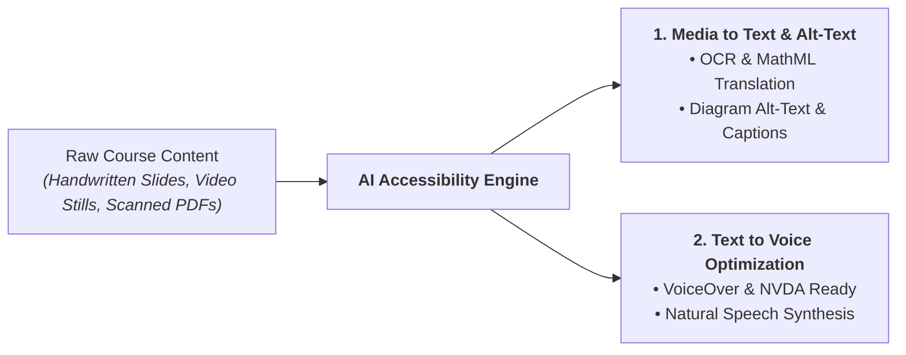

# ♿ Course Content Accessibility Engine
> **UMN Data Science Hackathon 2026** — *Automating Federal Compliance for University Course Materials*

---

## 💥 The Problem: Federal Mandates vs. Zero Resources

* **The Law:** Revised Section 508 & WCAG 2.1 AA require **100% of university electronic content** to be fully accessible.
* **The Human Impact:** Students with disabilities are left behind when course materials lack screen-reader support or math accessibility.
* **The Instructor Crisis:** Converting legacy handwritten slides, math equations, scanned PDFs, and lecture videos takes hundreds of hours. **Universities face legal mandates to comply, but severely lack the time, budget, and staff.**

---

## ⚡ Our Solution: 2 Killer Features



### 1️⃣ Media to Text (`Media-to-Text`)
* **Handwritten OCR to HTML:** Transforms handwritten lecture notes, slides, and whiteboard snapshots into clean, semantic HTML (`h1`, `h2`, `p`, `table`).
* **Native Presentation MathML:** Translates complex handwritten math formulas, matrices, and symbols into native MathML for assistive technology.
* **Intelligent Alt-Text & Captions:** Automatically generates concise `alt` tags and detailed `<figcaption>` elements for plots, circuits, and visual figures.
* **Video & Media Transcripts:** Extracts slide text and visual context from lecture videos into synchronized reading streams.

### 2️⃣ Text to Voice (`Text-to-Voice`)
* **Screen Reader Optimization:** Engineered specifically for **VoiceOver**, **NVDA + MathCAT**, and **JAWS**.
* **Audio Synthesis Ready:** Formats math expressions, sub/superscripts, and visual tables for natural, fluent speech narration.
* **Reading Order Enforcement:** Guarantees strict visual-to-DOM sequence so text-to-speech tools never jump or skip context.

---

## 📜 Legal Compliance Matrix (Revised Section 508 & WCAG 2.1 AA)

| WCAG Criterion | What Passing Means Here | Compliance Method |
| --- | --- | --- |
| **1.1.1 Non-text Content (A)** | Math equations rendered in native MathML; concise `alt` + detailed `figcaption` for images. | Manual Review |
| **1.3.1 Info & Relationships (A)** | Structural `h1`/`h2`, `table`, `ul`/`ol` matching visual structure. | Manual Review |
| **1.3.2 Meaningful Sequence (A)** | DOM reading order strictly follows natural visual sequence. | Manual Review |
| **1.4.3 Contrast (AA)** | High-contrast template colors (near-black text on white). | Automated Pass |
| **1.4.5 Images of Text (AA)** | Handwritten text converted to real screen-reader HTML text. | Manual Review |
| **1.4.10 Reflow (AA 2.1)** | Responsive layout at 320px CSS width; math scrolls inside `.math-scroll`. | Automated Pass |
| **2.4.2 Page Titled (A)** | `<title>` and `<h1>` set deck title accurately. | Automated Pass |
| **3.1.1 Language of Page (A)** | Primary `html lang` specified (`en`). | Automated Pass |
| **Screen Reader Spot Check** | Verified with NVDA + MathCAT / VoiceOver across text, math, and diagram slides. | Manual Gate |

---

## 🛡️ Human-in-the-Loop Quality Gate (`review.md`)

* **Zero Hallucinations:** Engine outputs `deck.html` alongside `review.md` (`Status: blocked`).
* **Fast Verification:** Flags ambiguous handwriting or missing titles for instant 1-click instructor confirmation -> `Status: confirmed`.

---

## 🛠️ Repository & Quickstart

```bash
# 1. Environment Setup
cd skills/handwritten-slides-a11y
python3 -m venv .venv && .venv/bin/pip install -r requirements.txt

# 2. Normalize PDF slides into page images
.venv/bin/python scripts/normalize_pdf.py /path/to/slides.pdf

# 3. Validate WCAG 2.1 AA / Section 508 compliance
.venv/bin/python scripts/check_output.py out/slides/deck.html
```

```
.
├── skills/handwritten-slides-a11y/    # Agent skill package (SKILL.md, scripts, references)
│   ├── scripts/normalize_pdf.py       # PDF rasterizer & manifest builder
│   └── scripts/check_output.py        # Automated WCAG 2.1 AA / 508 compliance validator
└── README.md
```
